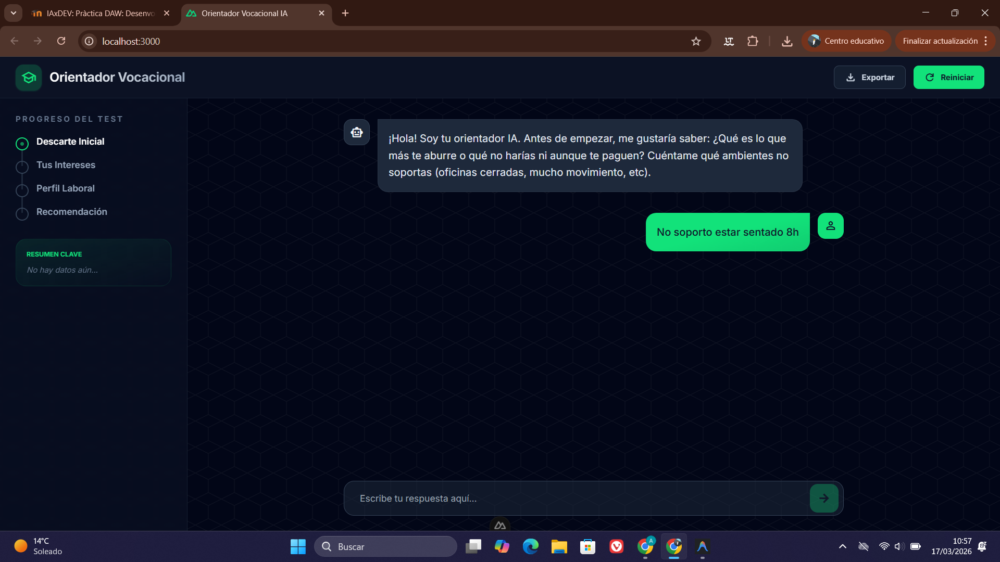

<h1 align="center">
  
  Bones! Soc en Alvaro
</h1>

# PROCÉS DE DESENVOLUPAMENT DEL CHATBOT

## Tota l'explicació s'ha agafat del fitxer PROCESS.md

## Exemples de prompts utilitzats

Durant el procés, s'han utilitzat prompts directes i iteratius per ajustar tant la funcionalitat com el disseny:

- **Definició del Producte**: "L'aplicació és una plataforma web interactiva que actua com a Orientador Vocacional Virtual. L'objectiu principal és ajudar a estudiants o persones en procés de cerca formativa a descobrir quins estudis (Cicles Formatius de Grau Mig/Superior, Graus Universitaris) s'adapten millor al perfil. Mitjançant una interfície de xat (bot), l'aplicació realitza una petita entrevista a l'usuari, analitzant les seves respostes, interessos i aptituds en tiempo real mitjançant Intel·ligència Artificial, per a finalment proporcionar una recomanació acadèmica i professional personalitzada."
- **Millora de la Interfície**: "vull que la interfície sigui més professional, amb un sidebar a l'esquerra que mostri el progrés del test (4 fases: Descarte Inicial, Tus Intereses, Perfil Laboral, Recomendación) i que tingui un fons amb un patró geomètric subtil."
- **Comportament de l'Input**: "vull que llevis el fons negre i només deixis les opcions (quick replies) que flotin sobre el fons del xat. Aquestes opcions només han de sortir al principi."
- **Funcionalitat d'Exportació**: "afegeix un botó per a exportar la conversa a un fitxer de text per a que l'usuari pugui guardar les recomanacions."
- **Personalitat del Bot**: "ajusta el sistema per a que el bot no sembli un robot. Prohibeix paraules com 'Entendido' o 'Comprendo'. Ha de ser un mentor jove i directe."

## Iteracions amb l'agent

El procés ha seguit diverses etapes d'ajust tècnic:

1. **Gestió d'Estat i Persistència**: S'ha implementat `localStorage` per guardar l'historial de xat (`vocational_chat_history`), permetent que l'usuari no perdi el progrés en recarregar la pàgina.
2. **Lògica de Progrés Dinàmic**: S'ha creat una propietat computada `currentPhaseIndex` que calcula automàticament en quina fase es troba l'usuari basant-se en el nombre de missatges intercanviats.
3. **Anàlisi de Paraules Clau**: S'ha implementat una lògica de filtratge (`userInterests`) que extreu paraules clau (com "aire lliure", "tecnologia", "ajudar") de les respostes de l'usuari per mostrar un resum visual al sidebar.
4. **UX de Xat**: Ús d'un composable personalitzat `useChatScroll` per assegurar que el xat sempre faci scroll cap avall quan arriba un missatge nou, millorant l'experiència d'usuari.
5. **Robustesa del Backend**: Implementació de validacions rigoroses a l'endpoint `/api/chat.post.js` per assegurar que els missatges tinguin el format correcte abans d'enviar-los a l'API de Gemini.

## Exemple de bug solucionat (Tò del Bot)

Es va detectar que el bot era massa repetitiu i formal. Es van aplicar les següents **REGLAS DE TONO** al `SYSTEM_PROMPT`:

- **CONCISIÓ**: Màxim 2 frases curtes per resposta.
- **ANTI-ROBÒTIC**: Prohibit iniciar respostes amb "Entendido", "Perfecto" o repetir el que l'usuari diu.
- **VALIDACIÓ HUMANA**: Ús d'expressions com "¡Totalmente!", "Tiene sentido" o "Me cuadra".
- **FORMAT ESTRICTE**: Les llistes de recomanacions han de seguir el format `1-Carrera` amb doble salt de línia per facilitar la lectura.

## Funcionalitats clau implementades

- **Sidebar de Progrés**: Visualització en temps real de l'etapa de l'orientació.
- **Respostes Ràpides (Quick Replies)**: Faciliten l'inici de la conversa amb opcions predefinides.
- **Exportació de Resultats**: Generació d'un fitxer `.txt` amb el resum de la sessió.
- **Resum d'Interessos**: Sistema de "tags" que apareixen al sidebar segons el que l'usuari explica.
- **Disseny Responsive i Dark Mode**: Interfície optimitzada per a dispositius mòbils i suport per a tema fosc automàtic.

## Captura del disseny generat vs resultat final

## Reflexió final sobre el procés

L'ús d'un agent d'IA per al desenvolupament ha permès realitzar canvis visuals complexos i ajustos de comportament de manera molt ràpida. La capacitat de l'agent per entendre instruccions de disseny visual ("que floten sobre el fons") traduint-les a classes Tailwind específiques i lògica de Vue3 ha accelerat enormement el cicle de feedback. La gestió de les quotes de l'API de Google i la selecció del model `gemini-2.5-flash` han estat claus per mantenir un rendiment òptim i un cost controlat durant les proves.
